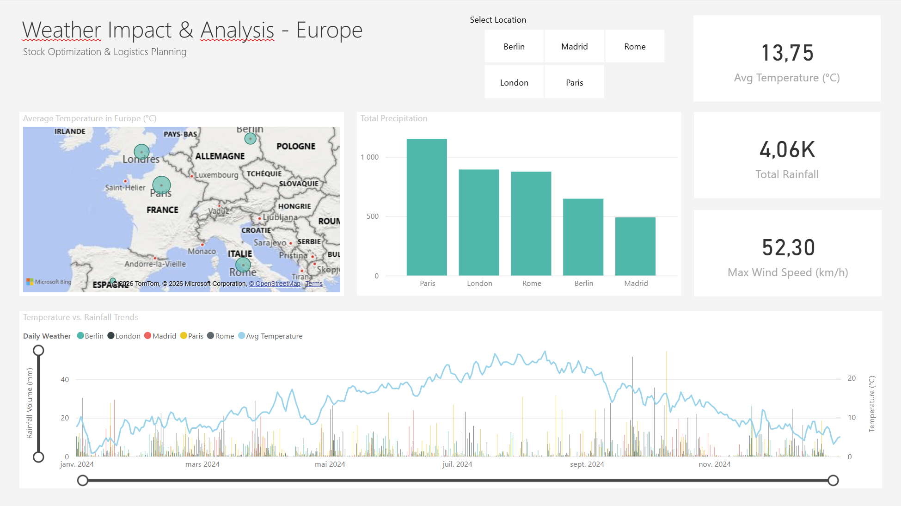
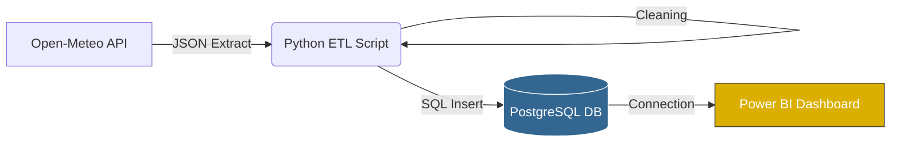

# 🌦️ Weather Data Pipeline & Dashboard

This project is a complete Data Engineering pipeline designed to automate weather data retrieval and support logistics decision-making (Retail).

It fetches historical weather data from major European cities, stores it in a Data Warehouse, and provides visual analytics to optimize clothing inventory based on climate trends.



## 🛠️ Technical Stack

* **Language:** Python 3.10
* **Database:** PostgreSQL (via Docker)
* **Visualization:** Microsoft Power BI
* **Libraries:** `requests` (API), `psycopg2` (SQL)

## 🚀 Setup & Usage

**1. Start the Database**
```bash
docker-compose up -d
```

**2. Install Python Dependencies**
```bash
pip install -r etl/requirements.txt
```

**3. Run the ETL Pipeline
```bash
python etl/main.py
```

